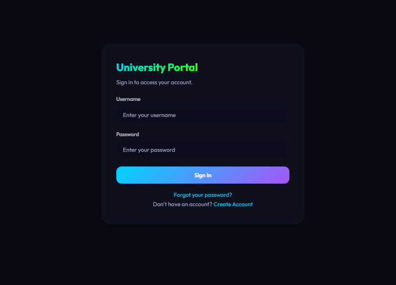
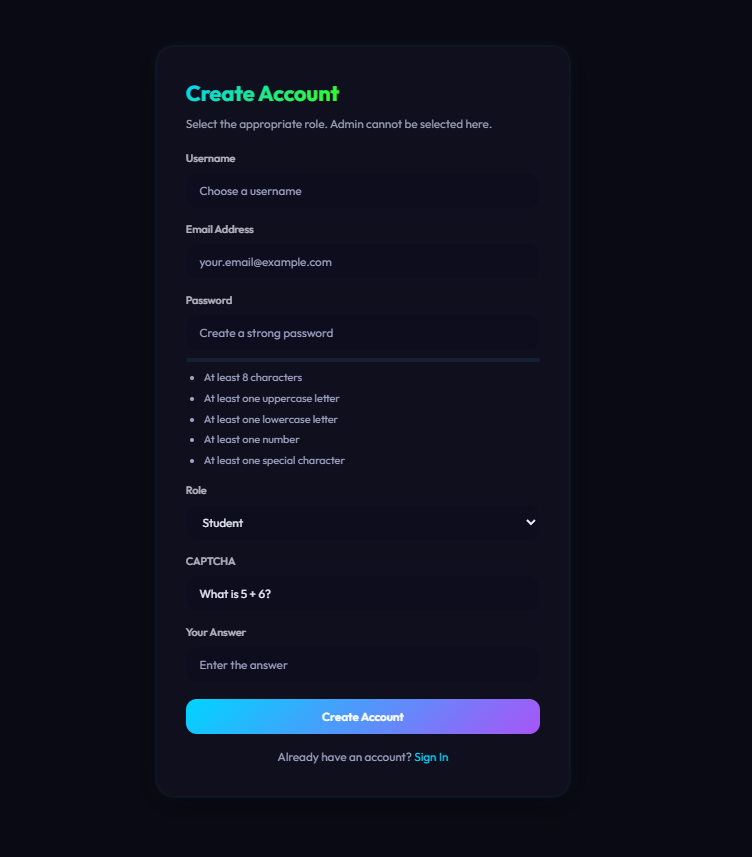
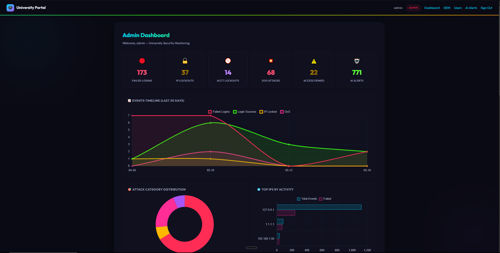
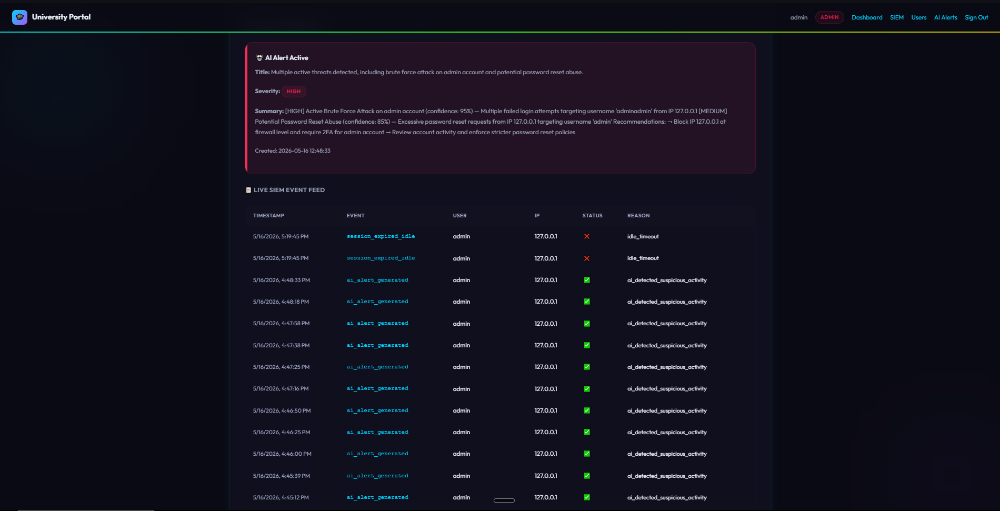
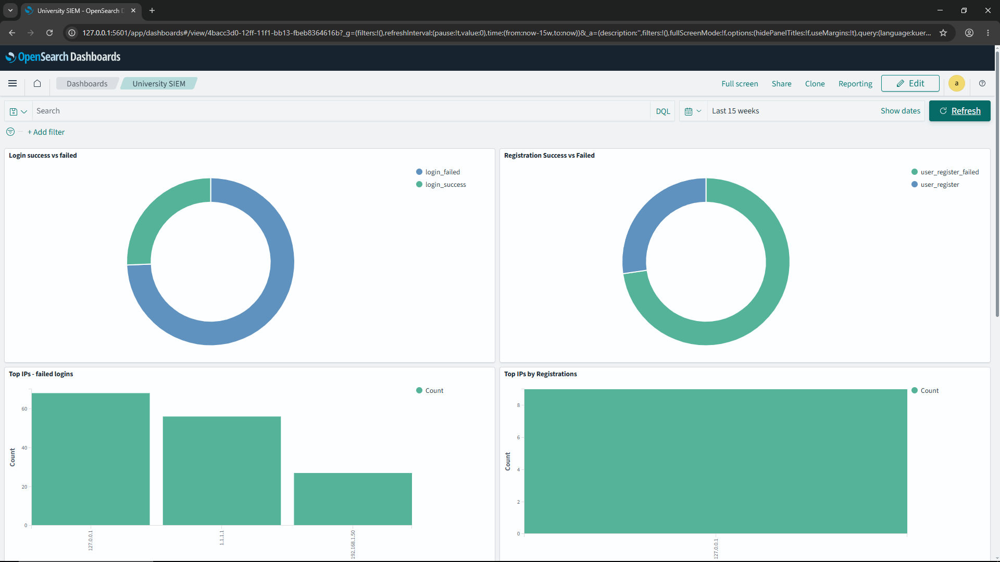
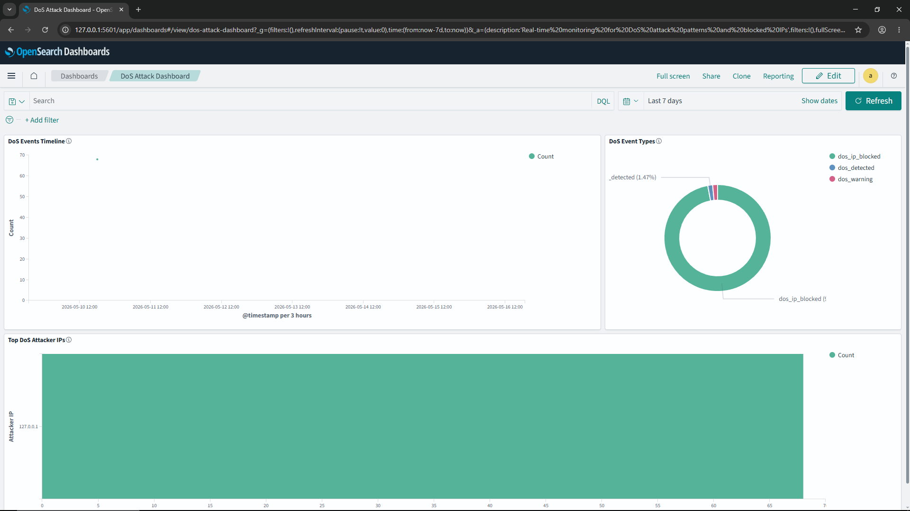

# University Portal SIEM

A security-focused university portal built as a graduation project. The system combines a Flask-based academic portal with centralized SIEM logging, OpenSearch dashboards, abuse prevention controls, and local AI-assisted threat analysis through Ollama.

## Project Overview

This project demonstrates how common university portal workflows can be protected and monitored using practical cybersecurity controls. Students and teachers can use normal academic features, while administrators can review users, monitor security events, and trigger AI analysis of suspicious activity.

Core goals:

- Provide role-based access for admin, teacher, and student users.
- Protect authentication and registration flows from brute force, bot, and abuse patterns.
- Forward structured security events to OpenSearch for SIEM-style visibility.
- Detect suspicious activity with dashboard counters, timelines, and AI-generated alerts.
- Include attack simulation scripts for validation and demonstration.

## Screenshots

### Portal Experience

| Sign in | Create account |
| --- | --- |
|  |  |

### Security Monitoring

| Admin dashboard | AI alerts and live SIEM feed |
| --- | --- |
|  |  |

### OpenSearch Dashboards

| University SIEM dashboard | DoS attack dashboard |
| --- | --- |
|  |  |

## Features

- Authentication and account lifecycle:
  - Login and logout
  - Student and teacher registration
  - Email verification for new accounts
  - Admin approval and role management
  - Password reset with verification codes
  - Authenticated password change with email verification

- Security controls:
  - Password policy enforcement
  - CSRF protection for state-changing form submissions
  - CAPTCHA-style registration challenge
  - IP-based rate limiting for login, registration, and password reset
  - In-memory DoS detection and temporary IP blocking
  - Idle and absolute session timeout handling
  - HTTP security headers including CSP, clickjacking protection, MIME sniffing protection, and no-cache headers
  - Role-based access control for admin, teacher, and student pages

- SIEM and monitoring:
  - Structured event forwarding to OpenSearch
  - OpenSearch Dashboards integration
  - Admin dashboard counters and live log APIs
  - Attack reason breakdowns, top IPs, event timelines, and DoS stats

- AI-assisted security analysis:
  - Pulls recent security logs from OpenSearch
  - Builds behavioral summaries by IP, username, and attack pattern
  - Uses a local Ollama model to classify suspicious activity
  - Stores AI alerts in SQLite for admin review

- Demonstration scripts:
  - Brute force simulation
  - Mass registration simulation
  - Password reset abuse simulation
  - Unauthorized access checks
  - DoS request burst simulation
  - SIEM and AI alert validation

## Tech Stack

- Python
- Flask
- SQLite
- OpenSearch
- OpenSearch Dashboards
- Ollama with `llama3.1:8b`
- Docker Compose

## Project Structure

```text
.
+-- app/
|   +-- app.py                    # Flask application factory and middleware
|   +-- config.py                 # Environment-based configuration
|   +-- models.py                 # SQLite schema and admin seeding
|   +-- routes/                   # Auth, admin, teacher, and student routes
|   +-- services/                 # SIEM, AI analysis, rate limiting, sessions, email
|   +-- static/                   # CSS
|   +-- templates/                # Jinja templates
|   +-- attack_*.py               # Individual attack simulations
|   +-- test_attacks.py           # End-to-end security test script
+-- docker/
|   +-- docker-compose.yml        # OpenSearch and Dashboards
+-- export_docker_data.bat        # Optional backup helper
+-- setup_new_pc.bat              # Optional restore/setup helper
```

## Getting Started

### Prerequisites

- Python 3
- Docker Desktop
- Ollama, optional but required for AI alert analysis

### 1. Configure the app

Copy the example environment file and edit values for your machine:

```powershell
Copy-Item app\.env.example app\.env
```

At minimum, set:

- `SECRET_KEY`: generate one with `python -c "import secrets; print(secrets.token_urlsafe(48))"`
- `DEFAULT_ADMIN_PASSWORD`: the first admin password for your local database
- `OS_PASS`: the same password used for OpenSearch, if SIEM logging is enabled

The app fails fast if required secret values are empty or left as unsafe demo placeholders. For an isolated classroom demo only, set `ALLOW_INSECURE_DEMO_CONFIG=true`.

SMTP is optional for basic login, admin, teacher, and student workflows. Email verification and password reset delivery require SMTP settings.

### 2. Install Python dependencies

```powershell
cd app
python -m venv venv
venv\Scripts\activate
pip install -r requirements.txt
```

### 3. Start OpenSearch

Copy the Docker environment template and set the same password used by `OS_PASS` in `app/.env`:

```powershell
Copy-Item docker\.env.example docker\.env
```

Edit `docker\.env` and set `OPENSEARCH_INITIAL_ADMIN_PASSWORD`. Use the same value for `OS_PASS` in `app\.env`.

```powershell
cd ..\docker
docker compose up -d
```

OpenSearch runs on `https://localhost:9200`, and OpenSearch Dashboards runs on `http://localhost:5601`.

### 4. Start the portal

```powershell
cd ..\app
venv\Scripts\activate
python app.py
```

The portal runs at:

```text
http://127.0.0.1:5000
```

## Default Admin Account

On first run, the app seeds an admin account from environment variables:

- `DEFAULT_ADMIN_USERNAME`
- `DEFAULT_ADMIN_EMAIL`
- `DEFAULT_ADMIN_PASSWORD`

The application will not start with an empty or placeholder admin password unless `ALLOW_INSECURE_DEMO_CONFIG=true` is set for an isolated demo.

## Configuration Notes

- Keep `TRUST_PROXY_HEADERS=false` for normal local use. Enable it only when the app runs behind a trusted reverse proxy that controls `X-Forwarded-For`.
- Keep `FLASK_DEBUG=false` unless actively debugging locally.
- Set `SESSION_COOKIE_SECURE=true` only when serving the app over HTTPS.
- `OS_VERIFY_SSL=false` is convenient for the local OpenSearch container's self-signed certificate. Use a trusted certificate and set it to `true` for a real deployment.

## Attack Simulation

With the Flask app running, use:

```powershell
cd app
venv\Scripts\activate
python test_attacks.py
```

The script tests brute force lockout, registration abuse, password reset abuse, unauthorized access, CAPTCHA checks, SIEM logs, AI alerts, and DoS blocking. The DoS tests intentionally run last because they temporarily block the local IP in memory.

## GitHub Publishing Notes

Do not publish local runtime or private backup data. The `.gitignore` is configured to exclude:

- `app/.env`
- `app/database.db`
- `app/venv/`
- OpenSearch volume backups
- exported Docker images
- local Ollama models and SSH keys

## Security Notice

This is an academic graduation project and demonstration lab. Review configuration, credentials, deployment settings, email delivery, TLS, database storage, and secret management before using it outside a controlled local environment.
